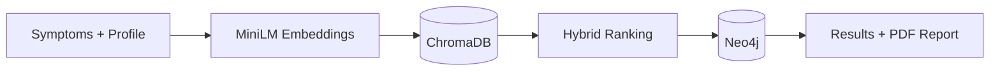

# 🩺 MedGraph AI

An AI-powered medical assistant that maps user symptoms to likely diseases and treatments using **RAG + ChromaDB + Neo4j**.

> ⚠️ Academic project for informational use only. Not a substitute for professional medical advice.

## Features

- Hybrid search: semantic retrieval (ChromaDB) + exact symptom matching
- Neo4j knowledge graph for medications, diet, precautions, and workouts
- Personalized results based on age, conditions, allergies, and symptom severity
- Emergency symptom detection with instant alerts
- Downloadable PDF report for doctor visits

## Architecture



## Tech Stack

Python · Sentence-Transformers (all-MiniLM-L6-v2) · ChromaDB · Neo4j · pandas · Streamlit · Docker

## Getting Started

```bash
git clone https://github.com/<your-username>/medgraph-ai.git
cd medgraph-ai
pip install -r requirements.txt
```

Create a `.env` file:

```env
NEO4J_URI=bolt://localhost:7687
NEO4J_USERNAME=neo4j
NEO4J_PASSWORD=your_password
```

Load the data and run the app:

```bash
python <etl_script>.py
streamlit run <app_file>.py
```

Or with Docker: `docker-compose up --build`, then open http://localhost:8501

Built for the Advanced Databases in AI at UT Dallas.
